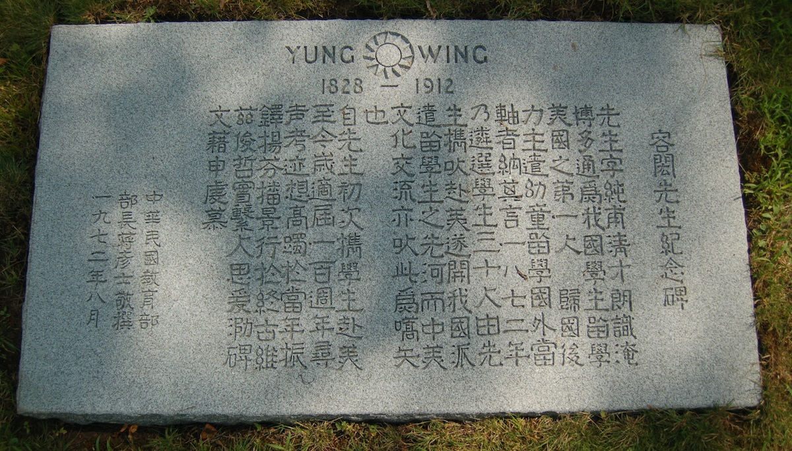
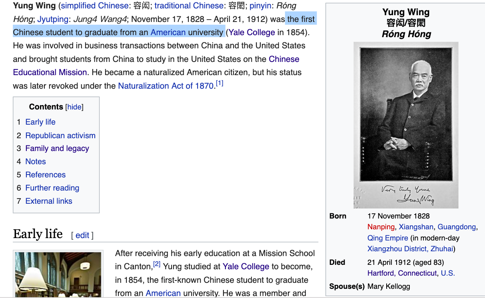

## A New Adventure

+ Themed "Statistical Data Science in Action" (grocery bag)

<!-- + 450 registrants compared to 250 two years ago at UConn -->

+ Restructured, 3-day event instead of 2-day, under the umbrella of
  the New England Statistical Society

+ Hartford instead of Storrs
    - Easy access
	- The Insurance Capital of the World
	- Top-rated tourist attractions (e.g., Mark Twain House & Museum, State Capital, Science Center, etc.)
	- Lesser known attractions
		+ New England Air Museum 
        + Connecticut river cruises
		+ Iwo Jima Memorial 
	- A city of long history 
		+ Yung Wing's grave at Ceder Hill Cemetery

## Yung Wing and Hartford

## Yung Wing Wiki Page

## Chinese Educational Mission and Hartford

## Expect Excitement

+ Successful short courses

+ Four plenary presentations (Inaugural Chernoff Lecturer's identity to be revealed)

+ Travelers Stat-a-thon final presentations (10 teams including one from a high school)

+ Non-technical sessions (career development; communication;
  ledership; teaching data science)

+ Showcase of data science in action

+ Special session honoring Prof. Rick Vitale

+ 48 Posters (most of which competing for Liberty Mutual Student Poster Award)

+ Closing award ceremony (Travelers Stat-a-thon, Liberty Mutual Student Poster; IBM Student Paper)

## Logistics

+ All plenary events are in the Ballroom
    - Keynotes
    - Banquet talk
    - Chernoff Lecture
    - Closing student award ceremony

+ All food/drinks (breakfasts, lunches, tea breaks) are in the Ballroom

+ Breakout sessions' room assignment was challenging
    - Colt and Wadsworth are small
	- Saratoga A is on the 6th floor (guest room elevator): sessions
      we have faith in attracting people to take the steps
+ Wifi passcode: uconn2019

+ Apologies for anything that we missed during the organization: help
  us do better next time
	

## Thanks

+ New England Statistical Society (NESS)

+ Committees and subcommittees of the organization

+ Sponsors
    - Munich Re Group - Hartford Steam Boiler Inspection and Insurance Co.
    - Travelers Insurance; Liberty Murual Insurance
    - Pfizer; IBM; Taylor-Francis; ASA CT Chapter

+ Student volunteers (shake their hands at the registration and
  meeting rooms)

+ UConn, Hilton, and PSAV staff
